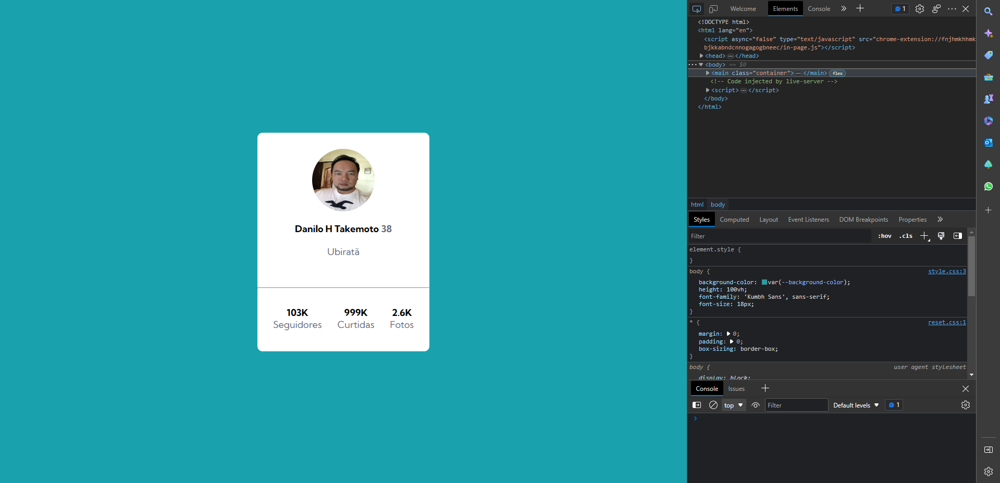
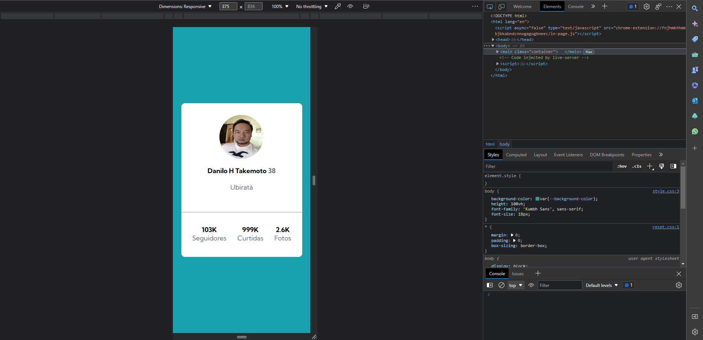

# Exercício HTML + CSS Avançado - Profile Card

Esse exercício é uma ALTERNATIVA ao desafio  Frontend Mentor | Profile card component coding challenge. Onde o principal desafio é criar um cartão que contenha as informações de perfil. Para ser aprimorado as habilidades de posicionamento de elementos usando flexbox. 

## Design Desktop

[]

## Design Mobile

[]

## Tecnologias usadas
- HTML 5
- CSS